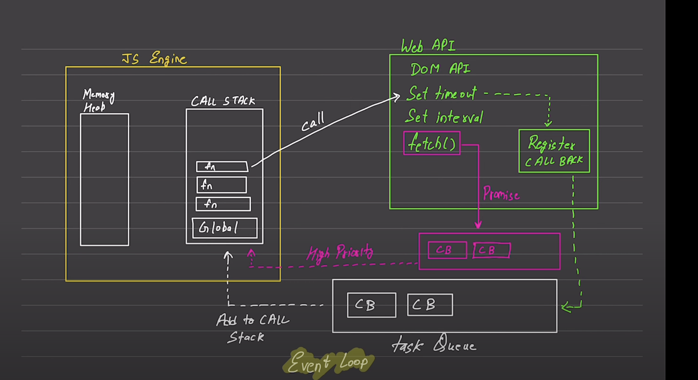

# Async function

# javascript

## 1. synchronious

## 2. single threaded - default JS

# Execution context

## 1. execute one line at a time line by line

### example - 1. console.log(1) then console.log(2) , ...... console.log(n)

## Call stack , Memory heap

## each operation waits for the last one complete before executing

# Blocking code -

## 1 block the flow of the program

## 2 read file sync

# Non blocking Code -

## 1 Does not block execution

## 2 Read file async

# Diagram

